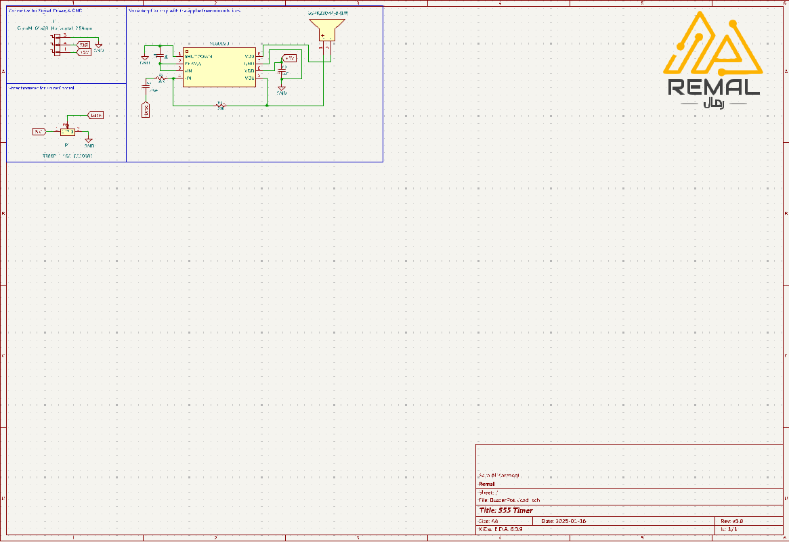

# Buzzer Pot PCB Project
A PCB designed to drive a passive buzzer for Remal.

## Project Overview
It is a simple project made only for easy access to buzzers, designed using a MOSFET and a potentiometer to adjust the volume. This project is compatibile with 3.3V to 12V.

## Features
- MOSFET Buzzer Driver: Uses the AO3400-HXY MOSFET for efficient switching.
- Wide Voltage Support: Operates from 3.3V to 12V, making it suitable for various microcontrollers and power sources.
- Flyback Protection: A Schottky diode protects the MOSFET from high-voltage spikes caused by the buzzer’s inductance.
- Compact PCB Design: Minimalist layout with proper spacing for high-voltage operation.
- Potentiometer Control (user firendly)

## Circuit Schematic

## PCB Layout

## Usage
To use the board:
1. Connect Power - Attach a power source (3.3V - 12V).
2. Apply a PWM Signal from a microcontroller.
3. Test Voltage Levels using the potentiometer
